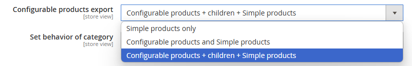
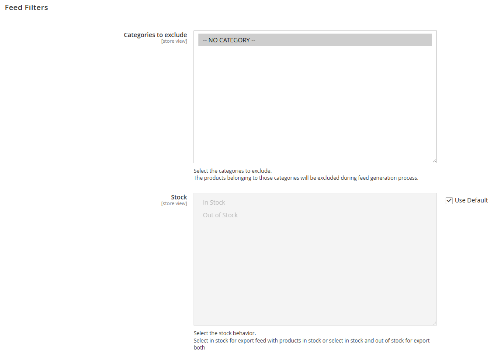
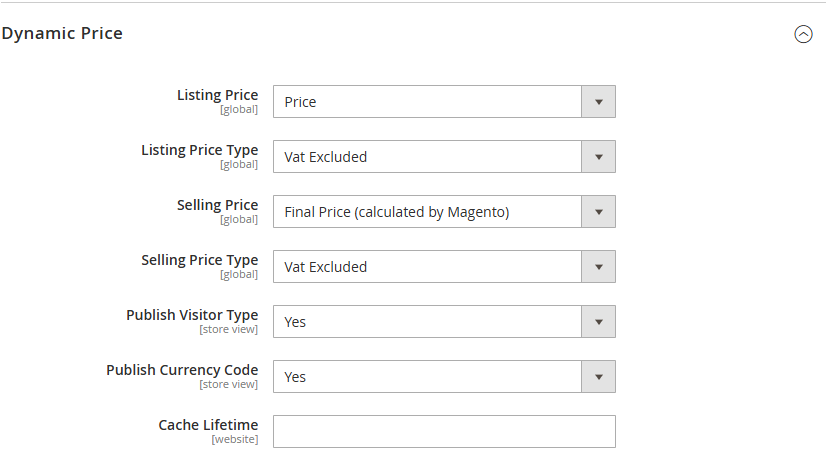

# Accelasearch Magento 2
This document is available in [English](README.md), [Italian](README.it.md).

## Overview
The Accelasearch Magento 2 module integrates the [Accelasearch](https://accelasearch.com)
search platform with Magento. It provides tools for exporting product feeds,
exposing search endpoints, and configuring dynamic prices directly from your
store.

## Installation
### Composer Installation
Install the module through [Composer](https://getcomposer.org/]):
```sh
composer require accelasearch/magento2
```
Enable the module:
```sh
bin/magento module:enable AccelaSearch_Search
```
Upgrade Magento's database and dependencies:
```sh
bin/magento setup:upgrade
```
Compile dependency injection:
```sh
bin/magento setup:di:compile
```
Compile static content:
```sh
bin/magento setup:static-content-deploy
```
Clear cache:
```sh
bin/magento cache:flush
```

### Manual Installation
Download package from GitHub:
```sh
wget https://github.com/accelasearch/magento2-module/archive/refs/heads/main.zip
```
Extract the zip file:
```sh
unzip main.zip
```
Copy its content into Magento's appropriate location:
```sh
cp -R main/* app/code/AccelaSearch/Search
```
Enable the module:
```sh
bin/magento module:enable AccelaSearch_Search
```
Upgrade Magento's database and dependencies:
```sh
bin/magento setup:upgrade
```
Compile dependency injection:
```sh
bin/magento setup:di:compile
```
Compile static content:
```sh
bin/magento setup:static-content-deploy
```
Clear cache:
```sh
bin/magento cache:flush
```


## Feed Configuration
___
### Feed Status


Enables or disables feed export
___
### Use Vue Storefront


If enabled it will be possible to specify a custom image size for the export process
___
### Export Directory


Specifies destination directory for the XML feeds, relative to Magento 2 root
___
### Custom Base URL


Allows to specify a custom base URL, for example when using VUE to retrieve images of products

___
### Configurable Products Export


Allows to specify how products are exported

- Simple products only
- Configurable products and Simple products
- Configurable products + children + Simple products
___
### Category


Specifies whether selected categories should be included or excluded


___
### Exclude from Path generation


Specifies categories which shall be excluded by the category path generation process.
As an example, if some categories are specific for some language, they should be excluded from the feed of other Storeviews.

___
### Stock behavior

This configuration is visible only per store or website.

Select the stock behavior.
Select in stock for export feed with products in stock or select in stock and out of stock for export both.

The check is made on `cataloginventory_stock_item` table and currently multi source inventory is not supported.

___
### Search


Specifies endpoint where the JavaScript code of AccelaSearch can be accessed, as well as an optional CSS to be included for overriding and customization
___
### Fields


Specifies main fields for the feed. Some fields will be inherited form the GoogleShopping module and will not be used by AccelaSearch


Allows to specify additional values for custom fields which will be mapped as *key => value*


Allows to specify attributes with multiple values which will be exploded over multiple rows, as dictated by Google Shopping specifications
___
### Cron Configuration


Allows to enable a cronjob to scheduler generation of feeds, as well as configure the relative cron expression and schedule the process as soon as possible.
___
### Notification


Allows to specify a set of email addresses to which notify products affected by errors during the feed generation process
___
### Dynamic Price


Exposes an endpoint which AccelaSearch can query to get dynamic prices depending on type of customer and currency code.

Prices on feed file will also follow this configuration when possible

- Listing price: Attribute used to identify prices, **this configuration is used also for the feed file**
- Listing price type: configure VAT included or excluded, **this configuration is used also for the feed file**
- - VAT will work only if configured and tax class is correctly set on the product
- Selling price: configure which attribute to use for price, **this configuration is used also for the feed file** 
- Selling price type: configure VAT included or excluded, **this configuration is used also for the feed file**
- - VAT will work only if configured and tax class is correctly set on the product
- Public Visitor Type: Whether to export customer group
- Public Currency Code: Whether to export currency code
- Cache Lifetime: Time to live of dynamic price (used for caching)


## Comandi Manuali
Generates feeds as configured:
```sh
bin/magento accelasearch:generate:feed
```

## Cron
Default cron expression (configurable through user interface):
```sh
0 1 * * *
```

## NOTE
This module generates a lock file under `var/locks` in order to prevent concurrent feed generation processes.
Bundle and Grouped products are managed in similar way as Configurable products
Multi Source Inventory is not managed by this module
